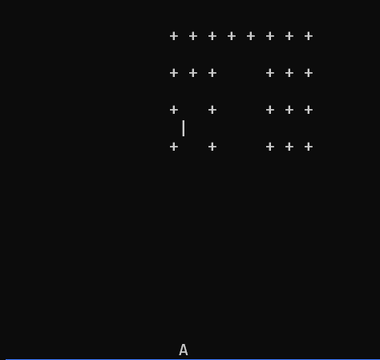

# Rust Invaders Game

This is a simple, text-based 2D "Invaders" game built in Rust, inspired by the classic Space Invaders arcade game. It uses basic Rust structures for game entities, time control, and movement logic, making it an interesting project to learn the basics of game development with Rust.

### Features:
- A grid of invaders moves and shoots at regular intervals.
- The player can shoot and kill invaders.
- The game ends when all invaders are killed or when they reach the bottom of the screen.
- Easy-to-follow logic with Rust's `std::time` for intervals and time manipulation.

## Installation

Before running the game, you need to have [Rust](https://www.rust-lang.org/) installed on your machine.

To install Rust, you can run the following command:

```bash
curl --proto '=https' --tlsv1.2 -sSf https://sh.rustup.rs | sh
```

Once Rust is installed, clone this repository to your local machine:

```bash
git clone https://github.com/abhilov23/Rust_projects.git
```

Then, navigate to the `3_invaders_game` folder:

```bash
cd Rust_projects/3_invaders_game
```

## Running the Game

To run the game, use the following command:

```bash
cargo run
```

This will compile and execute the project, allowing you to interact with the game. The game logic runs in a loop and can be controlled by updating or pressing buttons on the terminal.

## Screenshots

Here is an example screenshot of the game in action:



## Files in this Repository

- **`src/main.rs`**: The entry point to the game where the game loop runs.
- **`src/invaders.rs`**: This file contains the core game logic for managing the invaders (e.g., creating, moving, killing).
- **`src/frame.rs`**: Contains the drawing logic for rendering the frame with invaders.
- **`Cargo.toml`**: Rust's package configuration file that handles dependencies and builds.

### Dependencies

- `rusty_time`: A timer package used to handle the movement of invaders and other time-based events.

## Game Mechanics

### Invaders

The invaders are placed within a grid (`NUM_COLS` x `NUM_ROWS`). The movement of these invaders follows simple patterns:
- Invaders move horizontally across the screen. They change direction when they hit the edges.
- After reaching a certain point, they move one row down.

### Player Actions

- You can shoot to kill invaders at specific coordinates.
- Once a shot hits an invader, that invader is removed from the grid.

### Endgame

The game ends either when:
1. All invaders are killed (`army.is_empty()`).
2. Invaders reach the bottom of the screen (`reached_bottom()`).

## Future Improvements

- **Player Input:** Add control for player movements (e.g., left/right).
- **Scores:** Implement a scoring system where points are awarded for each killed invader.
- **Difficulty Levels:** Increase the speed and complexity of invader movements as the game progresses.

## License

This project is open-source, available for use and modification. Feel free to contribute, fork, or submit issues.

---

Feel free to customize the game and extend its functionality as needed.
